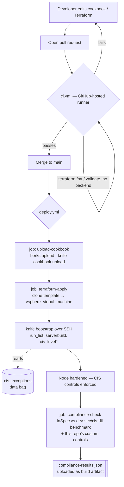

# CIS Benchmark Level 1 Hardening — Chef + Terraform

Sample project implementing CIS Level 1 hardening for on-premises Windows and Linux
servers, using **Chef Infra** for remediation, **Chef InSpec** for compliance
verification, **Terraform** for on-prem provisioning (vSphere), **Packer** for
optional golden-image builds, and **GitHub Actions** for CI/CD.

Full written guide (design decisions, rationale, command references, runbooks): see
`CIS_Level1_Chef_Terraform_Implementation_Guide.docx`, `docs/pipeline_runbook.md`,
and `docs/onprem_hardening_solutions.md` (live-bootstrap vs. golden-image, split by
Windows/Linux) delivered alongside this project.

---

## 1. Repository structure

```
.
├── .github/workflows/        CI (every PR) and deploy (merge to main) pipelines
├── chef/
│   ├── cookbooks/
│   │   ├── cis_level1/       CIS Level 1 hardening cookbook (Linux + Windows)
│   │   └── serverbuild/      Example EXISTING build cookbook — kept separate
│   │                         from cis_level1 on purpose; see §6 below
│   ├── data_bags/
│   │   └── cis_exceptions/   Exception list — which nodes are exempt from a
│   │                         control, why, who approved it, review date
│   ├── environments/         dev / production attribute overrides
│   └── roles/                run_list definitions (serverbuild → cis_level1)
├── terraform/
│   ├── modules/onprem_server/    Reusable vSphere VM + Chef bootstrap module
│   └── environments/production/  Environment-specific Terraform root
├── packer/                   Golden-image templates (optional pre-baked hardening)
└── docs/                     Project-specific supplementary notes
```

---

## 2. High-level flow



Two things worth noticing in this diagram:

- **Verification runs *after* enforcement**, both locally (Test Kitchen converges,
  then InSpec verifies in the same `kitchen test`) and in the deploy pipeline
  (Chef hardens the node first, InSpec checks it afterward). This project does not
  do a pre-flight "audit-only" pass before deciding what to remediate — see §7 for
  what that would take.
- **Exceptions are consulted *during* enforcement**, inside the recipe itself,
  before a resource converges — not as a separate step.

---

## 3. Step-by-step: what happens, in order

| # | Stage | Trigger | Tool | What happens |
|---|---|---|---|---|
| 1 | Author | you, locally | Chef Workstation (cookstyle, berks) | Write/edit a recipe or Terraform file |
| 2 | Test | you, locally | Test Kitchen + InSpec | `kitchen test` converges a throwaway VM with `chef_zero`, then runs InSpec controls against it |
| 3 | Open PR | you, on GitHub | Git | Pushes the branch, opens a pull request into `main` |
| 4 | CI | GitHub, automatic | `ci.yml` | Lints, re-runs Kitchen, validates Terraform — no secrets, no real infra |
| 5 | Merge | you, on GitHub | Git | PR approved and merged into `main` |
| 6 | Upload | GitHub, automatic | `deploy.yml` job 1 | Cookbook pushed to the real Chef Server |
| 7 | Provision | GitHub, automatic | `deploy.yml` job 2 (Terraform) | Clones a base vSphere template into a new VM |
| 8 | Bootstrap & enforce | GitHub, automatic | `knife bootstrap` (inside Terraform) | Installs chef-client, runs `serverbuild` then `cis_level1` — this is where CIS settings actually get written |
| 9 | Verify | GitHub, automatic | `deploy.yml` job 3 (InSpec) | Re-checks the now-hardened node from the outside, independent of Chef, and writes a report |
| 10 | *(optional, any time)* | you, locally or in CI | Packer | Bakes `serverbuild` + `cis_level1` into a template *before* cloning, instead of hardening after |

---

## 4. Tools used, and what each one is for

| Tool | Role in this project | Why it's here specifically |
|---|---|---|
| **Git / GitHub** | Source control, pull requests, Actions runner, secrets store | Single source of truth for the cookbook, Terraform, and pipeline definitions |
| **Chef Workstation** | Local dev bundle: `chef-client`, `cookstyle`, `berks`, `knife`, `kitchen`, `inspec` | One install instead of five separate tools |
| **Cookstyle** | Ruby/Chef style linter | First gate in `ci.yml` — catches style issues before a real converge is even attempted |
| **Berkshelf (`berks`)** | Cookbook dependency resolver | `Berksfile` pulls `windows`, `windows-security-policy`, and `audit` from Chef Supermarket |
| **Chef Infra Client** | Applies recipes to a node, idempotently, every run | The actual enforcement engine — see §5 |
| **Test Kitchen** | Spins up a disposable VM/container, converges it, tears it down | Local + CI proving ground before anything touches a real node; uses `chef_zero` so no real Chef Server is needed to test |
| **Chef InSpec** | Compliance-as-code — asserts a node's *actual* state | Used two ways here: (a) `kitchen verify` after a local converge, (b) the `compliance-check` job against the live fleet post-deploy |
| **Chef Server + `knife`** | Central cookbook/role/environment/data-bag store for a real fleet | `knife cookbook upload`, `knife bootstrap`, `knife data bag` — only needed once you go past local testing |
| **Terraform** (`hashicorp/vsphere` provider) | Declares and provisions the VM itself | Clones a template, wires network/datastore/resource pool, then hands off to `knife bootstrap` via a `null_resource` |
| **Packer** | Bakes hardening into a *template*, ahead of time | Alternative to bootstrapping after every clone — same recipes, run once per template instead of once per VM |
| **GitHub Actions** | Orchestrates all of the above automatically | `ci.yml` on every PR, `deploy.yml` on every merge to `main` |

---

## 5. Enforcement — how a CIS control actually gets applied

Chef is a **converging** configuration tool: every recipe run compares the node's
current state to the desired state declared in `attributes/default.rb` and only
changes what's drifted. There is no separate "apply" step distinct from a normal
chef-client run — enforcement *is* the run.

Example, from `recipes/linux_ssh.rb`:

```ruby
template '/etc/ssh/sshd_config' do
  variables(
    permit_root_login: exempt ? 'yes' : node['cis']['linux']['ssh']['permit_root_login'],
    max_auth_tries:    node['cis']['linux']['ssh']['max_auth_tries']
  )
end
```

`node['cis']['linux']['ssh']['permit_root_login']` is set to `'no'` in
`attributes/default.rb` — that's the CIS-mandated value. Every recipe follows the
same pattern: the desired value lives in attributes, the recipe writes it into a
config file/template/resource, and Chef only touches the file if it's out of sync.

---

## 6. Exceptions — how a node gets *excused* from a control

Some controls can't be applied everywhere immediately (a legacy app that still needs
root SSH login, for example). Rather than hand-editing recipes per node, exceptions
are modeled as **data**, reviewed like any other change:

`chef/data_bags/cis_exceptions/ssh_root_login.json`:
```json
{
  "id": "ssh_root_login",
  "exempt_nodes": ["legacy-app-01", "legacy-app-02"],
  "reason": "Pending application migration - JIRA TICKET-4521",
  "approved_by": "security-team",
  "review_date": "2026-12-01"
}
```

And the recipe that consults it, `recipes/linux_ssh.rb`:
```ruby
exceptions = begin
  data_bag_item('cis_exceptions', 'ssh_root_login')
rescue
  nil
end
exempt = exceptions && exceptions['exempt_nodes'].include?(node.name)
```

The check happens **before** the resource converges, inside the recipe — so an
exempted node gets `permit_root_login 'yes'` written on purpose, not by accident,
with the reason and approver sitting right next to the exemption in version control.

> **Current scope:** this exception pattern is wired up for exactly one control
> (`ssh_root_login`, in `linux_ssh.rb`). The other recipes (`linux_filesystem`,
> `linux_password_policy`, `linux_auditd`, `linux_sysctl`, and the Windows recipes)
> don't yet check the data bag — extending the same `data_bag_item` /
> `exempt_nodes.include?` pattern into each of them is the way to add exceptions
> for other controls.

Before the first production run, the data bag has to exist on the Chef Server:

```bash
knife data bag create cis_exceptions
knife data bag from file cis_exceptions ssh_root_login.json
```

---

## 7. Audit / verification — how you know a control actually took

"Audit" here means **Chef InSpec**, and in this project it runs *after*
enforcement, not before:

| Where | When | What |
|---|---|---|
| `kitchen verify` (part of `kitchen test`) | Local dev, and again in `ci.yml` | Runs the controls in `chef/cookbooks/cis_level1/test/integration/controls/` against the just-converged Kitchen instance |
| `compliance-check` job in `deploy.yml` | After `terraform-apply` bootstraps and hardens the real node | Runs the public `dev-sec/cis-dil-benchmark` InSpec profile, over SSH, against `FLEET_TARGET`, and uploads `compliance-results.json` as a build artifact |

Example control, `linux_ssh_spec.rb`:
```ruby
control 'cis-5.2.11' do
  impact 0.5
  title 'Ensure SSH MaxAuthTries is configured'
  describe sshd_config do
    its('MaxAuthTries') { should cmp <= 4 }
    its('PermitRootLogin') { should eq 'no' }
  end
end
```

InSpec doesn't know or care that Chef was the thing that set these values — it reads
the actual file on disk independently. That's the point: it's a check *of* the
outcome, not a check *by* the same tool that produced it.

### What "audit-before-enforce" would add, if you want it

Right now, nothing runs InSpec against a node *before* Chef converges it — Chef
always applies the desired state on every run regardless of current drift (which is
normal and correct for a converging tool). If you want a true pre-flight audit gate
— e.g. "scan first, only remediate what's actually out of compliance, skip
controls with an open exception before touching anything" — three pieces are
already in this repo to build on, but aren't wired together yet:

1. **The `audit` cookbook** is already a dependency (`metadata.rb`,
   `depends 'audit', '~> 8.0'`) but has no `audit_profile` resource or attributes
   configured — Chef Software's audit cookbook runs InSpec profiles *as part of* a
   chef-client run and reports results to Chef Automate, without itself making
   changes. Configuring it would give you continuous compliance reporting on every
   run, separate from the `deploy.yml` compliance-check job.
2. **`chef-client --why-run`** (dry-run mode) reports what a run *would* change,
   without changing it — useful as a scan step ahead of a real converge.
3. **The exceptions data bag** already gates enforcement per-control (§6); the same
   lookup could gate an audit-only InSpec run too, so exempted controls are
   reported as "waived" rather than "failed."

---

## 8. Quick start

```bash
# One-time local setup
curl -L https://omnitruck.chef.io/install.sh | sudo bash -s -- -P chef-workstation

# Lint + test the CIS cookbook locally
cd chef/cookbooks/cis_level1
cookstyle .
kitchen test

# Upload to your Chef Server
berks install && berks upload
knife cookbook upload cis_level1

# Provision an on-prem server and bootstrap Chef via Terraform
cd ../../../terraform/environments/production
terraform init
terraform plan -out=tfplan
terraform apply tfplan
```

---

## 9. CI/CD

- **`.github/workflows/ci.yml`** — runs on every pull request: cookstyle lint,
  Test Kitchen converge + verify, `terraform validate`. Runs entirely on a
  GitHub-hosted runner — no secrets, no real infra required.
- **`.github/workflows/deploy.yml`** — runs on merge to `main`: uploads the
  cookbook to the Chef Server, applies Terraform (which bootstraps and hardens the
  new node), then runs an InSpec compliance check against the fleet. Needs four
  repo secrets (`CHEF_KNIFE_RB`, `CHEF_CLIENT_PEM`, `VSPHERE_PASSWORD`,
  `FLEET_TARGET`) plus a real Chef Server, vCenter, and Terraform S3/DynamoDB
  state backend — see `docs/pipeline_runbook.md` §9–11 for the full checklist and
  local-testing alternatives if you don't have that infrastructure yet.

---

## 10. Why `cis_level1` and `serverbuild` are separate cookbooks

CIS controls change on a different cadence than application build logic, are
reviewed by a different owner (security vs. platform team), and need to run
strictly *after* the build cookbook finishes. Keeping them as two cookbooks — both
included in the same run list — makes that ordering explicit:

```ruby
run_list "recipe[serverbuild]", "recipe[cis_level1]"
```

See section 2.3 of the full guide for the complete rationale.

## License

Internal project template — adapt freely for your organization.
